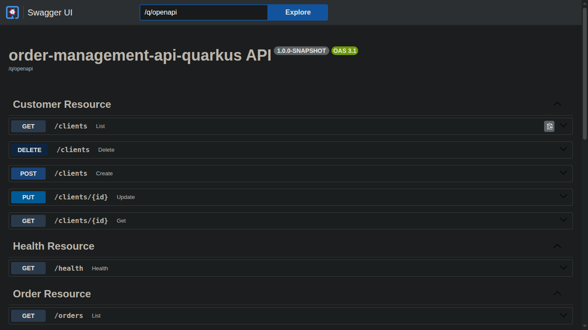
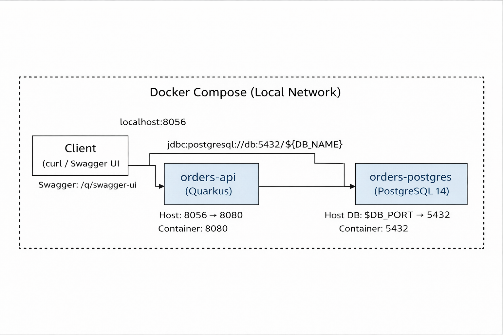

# Order Management API (Quarkus)

API backend para gerenciamento de **Clientes** e **Pedidos**, construída com **Quarkus**, **PostgreSQL**, **Hibernate ORM + Panache**, **Flyway** e **Docker Compose**.

> Porta padrão (host): **8056**

## Stack
- Java 21 + Maven Wrapper (`./mvnw`)
- Quarkus (RESTEasy Reactive + Jackson)
- Hibernate ORM + Panache
- PostgreSQL
- Flyway (migrations)
- Docker / Docker Compose
- Testes: `@QuarkusTest` + RestAssured

---

## Requisitos
- Java 21
- Docker + Docker Compose
- Git (opcional)

---

## Rodar com Docker (recomendado)

### 1) Configurar variáveis (dev)
Crie um `.env` local a partir do exemplo:

```bash
cp .env.example .env
```

> **Importante:** `.env` não é versionado.

### 2) Build e subir containers
```bash
./mvnw clean package -DskipTests
docker compose up -d --build
```

### 3) Validar health
```bash
curl -i http://localhost:8056/health
curl -i http://localhost:8056/q/health/ready
```

> Se seu Docker exigir `sudo`, use `sudo docker ...` / `sudo docker compose ...` (ou configure permissão do Docker no seu usuário).

---

## Rodar local (dev mode)
Use quando quiser live reload:

```bash
docker compose up -d
./mvnw quarkus:dev -Dquarkus.profile=dev
```

---

## Banco de dados (Flyway)
- Migrations em: `src/main/resources/db/migration`
- Ao subir a aplicação (profiles `docker`/`prod`), as migrations são aplicadas automaticamente.

---

## Endpoints

### Clientes

Criar:
```bash
curl -s -X POST http://localhost:8056/clients \
  -H 'Content-Type: application/json' \
  -d '{"name":"Rodrigo","email":"rodrigo@email.com"}'
```

Listar:
```bash
curl -s http://localhost:8056/clients
```

Buscar por id:
```bash
curl -s http://localhost:8056/clients/{id}
```

Atualizar:
```bash
curl -s -X PUT http://localhost:8056/clients/{id} \
  -H 'Content-Type: application/json' \
  -d '{"name":"Rodrigo Barbosa","email":"rodrigo@email.com"}'
```

Deletar:
```bash
curl -i -X DELETE http://localhost:8056/clients/{id}
```

### Pedidos

Criar:
```bash
curl -s -X POST http://localhost:8056/orders \
  -H 'Content-Type: application/json' \
  -d '{"customerId":"{customerId}","amount":129.90}'
```

Listar:
```bash
curl -s http://localhost:8056/orders
```

Buscar por id:
```bash
curl -s http://localhost:8056/orders/{id}
```

Atualizar status:
```bash
curl -s -X PATCH http://localhost:8056/orders/{id}/status \
  -H 'Content-Type: application/json' \
  -d '{"status":"PAID"}'
```

Endpoint de negócio — por status:
```bash
curl -s http://localhost:8056/orders/by-status/CREATED
```

Por cliente:
```bash
curl -s http://localhost:8056/orders/by-customer/{customerId}
```
---




---

## Padrão de erro (JSON)
Exemplo de resposta de erro padronizada:

```json
{
  "timestamp": "2026-02-18T06:14:32Z",
  "status": 404,
  "error": "Not Found",
  "message": "Customer not found",
  "path": "clients/{id}"
}
```

---

## Testes
```bash
./mvnw test
```

---

## Decisões de projeto (curto e objetivo)
- **Entidades encapsuladas** (campos `private`, métodos de domínio) para qualidade profissional.
- **DTOs** para request/response, evitando acoplamento direto entre entidade e API.
- **Flyway** para versionar schema e garantir reproduzibilidade.
- **Docker Compose** para subir API + Postgres rapidamente em qualquer máquina.

---

## Roadmap (próximos passos)
- Melhorar validação com **field errors** (erros por campo)
- Testes adicionais para Orders (status e filtros)
- Paginação e ordenação
- Autenticação (JWT) (opcional)